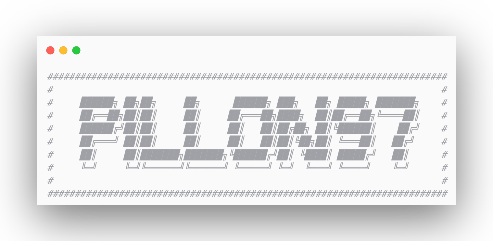

  

# 💫 About Me:
## 🙋‍♂️ About Me  🔨 I'm currently working on: **Hack The Box machines and improving my penetration testing skills**   🤝 I'm looking to collaborate on: **CTFs, security projects, and learning groups**   🧠 I'm looking for help with: **Active Directory exploitation and advanced privilege escalation**   🌱 I'm currently learning: **OSINT, exploit development, and Linux internals**   💬 Ask me about: **ethical hacking, red teaming, Linux, or anything security-related**   ⚡ Fun fact: **I love breaking things just to understand how they work!**

## 🌐 Socials:
  

# 💻 Tech Stack:
                 
# 📊 GitHub Stats:
 
 

---

<!-- Proudly created with GPRM ( https://gprm.itsvg.in ) -->
